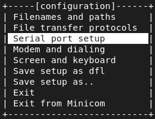
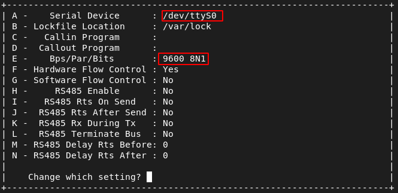
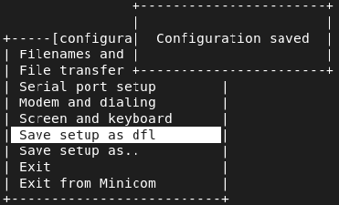
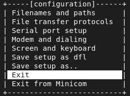

## Reset the switch:

Keep pressing about 10 sec on the front left button

## Accessing the command line:


- Connect a console cable between a Linux computer and the switch
- Then install and launch **minicom** on a terminal :  

```
sudo apt install minicom
sudo minicom -s  
```

- Change the port settings



- *ttyS0* and *9600* bauds



- Save the config



- <u>Exit</u> (do not go for *Exit from Minicom*)



## Configure the switch:

### Enable fast STP and BPDUGuard:

Not mandatory, but it saves time when a cable is plugged, otherwise the port is freezing for about 15-30 secs (meaning: configured by the STP protocol)

```
Switch>enable
Switch#conf t
Switch(config)#int ran GigabitEthernet 1/0/1-24
Switch(config-if-range)#spanning-tree portfast
Switch(config-if-range)#spanning-tree bpduguard enable
Switch(config-if-range)#exit
Switch(config)#exit
Switch#write
Switch#copy run start
```
### Configure VLANS and ports

ToDo : a pic of the front panel of the switch, with ports details annotations :

1-2  -> VLAN 1 (default one)

3-4  -> trunk VLANs 12-24 (For Linux servers)

5-8  -> Free for future use

9-12 -> For Wouter

13-24 -> For students (12)


```
Switch>enable
Switch#conf t
Switch(config)#vlan 12-24
Switch(config-vlan)#exit
Switch(config)#int GigabitEthernet 1/0/9-12
Switch(config-if)#switchport mode access
Switch(config-if)#switchport access vlan 12
Switch(config-if)#int GigabitEthernet 1/0/13
Switch(config-if)#switchport mode access
Switch(config-if)#switchport access vlan 13
Switch(config-if)#int GigabitEthernet 1/0/14
Switch(config-if)#switchport mode access
Switch(config-if)#switchport access vlan 14
Switch(config-if)#int GigabitEthernet 1/0/15
Switch(config-if)#switchport mode access
Switch(config-if)#switchport access vlan 15
Switch(config-if)#int GigabitEthernet 1/0/16
Switch(config-if)#switchport mode access
Switch(config-if)#switchport access vlan 16
...
...
Switch(config-if)#int GigabitEthernet 1/0/24
Switch(config-if)#switchport mode access
Switch(config-if)#switchport access vlan 24
Switch(config-if)#int ran GigabitEthernet 1/0/3-4
Switch(config-if-range)#switchport mode trunk
Switch(config-if-range)#switchport trunk allowed 12-24
```
